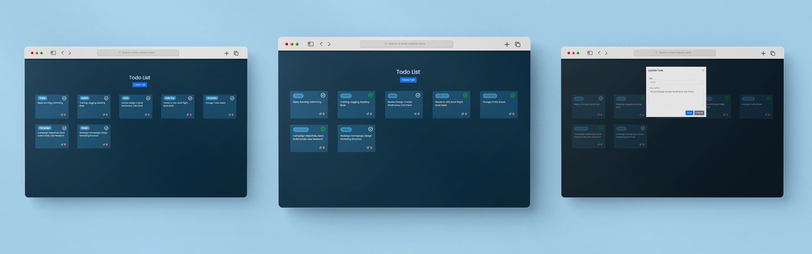

<h1 align="center" id="title">Todo-List using ReactJs</h1>

<p align="center"></p>

<h2>Project Screenshots:</h2>




  
  
<h2>🧐 Features</h2>

Here're some of the project's best features:

*   Create New Task
*   Edit Existing Task
*   Mark Task as Done!
*   Clearly differentiate pending tasks
*   Unmark task as pending

<h2>🛠️ Installation Steps:</h2>

<p>1. Clone this repository</p>

```sh
git clone "https://github.com/tilaktank/Todo-List.git"
```

<p>2. Navigate to the Todo-List directory</p>

```sh
cd Todo-List
```

<p>3. Install required packages</p>

```sh
npm install
```

<p>4. Run the project</p>

```sh
npm start
```

  
  
<h2>💻 Built with</h2>

Technologies used in the project:

*   Node
*   React
*   Bootstrap

<h2>Special Thanks</h2>

[Bhavin Vasara]("https://github.com/itzzmegrrr")